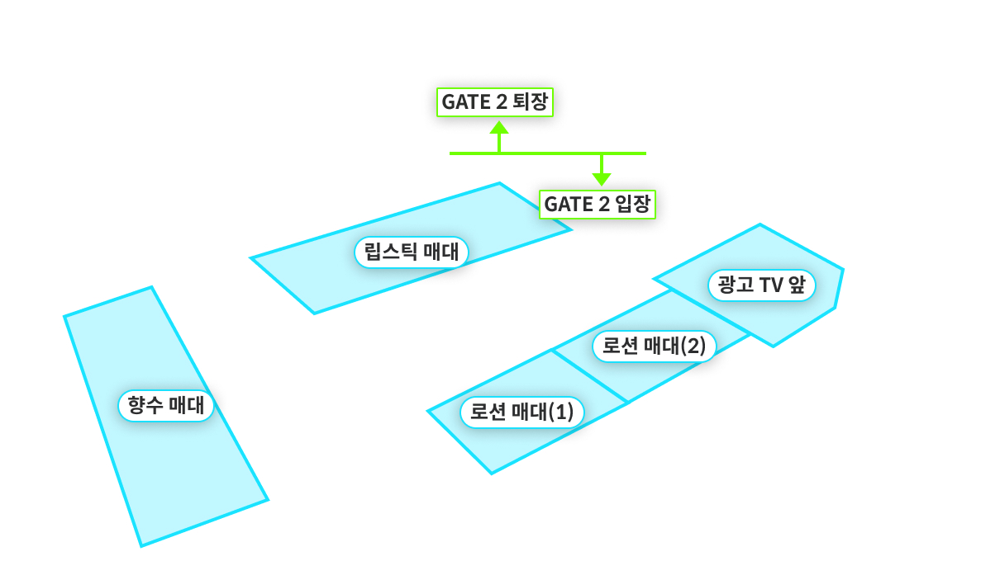
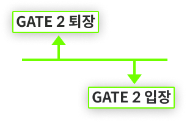

# 과제

## 실행 방법

> :bulb: `yarn`을 기반으로 작성된 프로젝트이기 때문에 `yarn` 사용하는 것을 권장합니다.

1. `yarn`
2. `yarn start`

## 과제 설명

서버에서 선과 다각형을 그리기 위한 정보를 제공합니다. 이 정보로 아래 이미지같이 캔버스에 선과 다각형을 시각화해주세요.
아래 자세한 요구 사항이 있으니 잘 읽고 요구 사항에 따라 구현해 주세요.


_결과물 예시_

## 요구 사항

> :bulb: client 폴더 하위에 있는 코드만 수정해 주세요. sever 폴더 하위에 있는 코드는 수정하실 필요가 없습니다.

1. 사용자가 `구역 불러오기` 버튼을 클릭 했을 때 서버에서 구역 정보를 요청해야합니다.

2. [Zone](#zone)은 구역을 나타내며 3개 이상의 각을 가지는 단순한 다각형입니다.

   - 요청의 결과로 zone은 1개 이상 제공될 수 있습니다.
   - 구역의 좌표는 **1920 X 1080** 해상도를 기준으로 작성되었습니다. 캔버스에 맞게 구역 좌표를 적절하게 변경해주세요.
   - zone은 label이라는 속성으로 이름을 가지고 있습니다.
     - 다각형의 무게 중심에 구역의 이름을 표시해주세요.
     - 디자인은 [과제 설명](#과제-설명)에 있는 예시와 동일하지 않아도 괜찮습니다. 사용자가 보기 쉽겠다고 생각하는 형태로 구현해 주세요.

3. [Line](#line)은 선분입니다.

   - 요청의 결과로 line은 1개 이상 제공될 수 있습니다.
   - 선분의 좌표는 **1920 X 1080** 해상도를 기준으로 작성되었습니다. 캔버스에 맞게 선분의 좌표를 적절하게 변경해주세요.

   - line은 label이라는 속성으로 이름과 direction이라는 속성으로 방향의 이름을 제공합니다.

     - 선분의 삼등분 점에 수선을 그어 방향의 이름과 선분의 이름을 표시해 주세요.
     - 방향의 이름과 선분의 이름이 canvas 밖으로 빠져나가더라도 괜찮습니다.
     - 디자인은 [과제 설명](#과제-설명)에 있는 예시와 동일하지 않아도 괜찮습니다. 사용자가 보기 쉽겠다고 생각하는 형태로 구현해 주세요.

       

       _라인 시각화 예시_

4. 서버는 일정 확률로 요청을 처리가 지연되거나 실패합니다.

   - 요청이 지연되더라도 추가적인 요청을 보낼 수 없도록 Loading 상태를 만들어주세요.
   - 요청이 실패했을 때, 실패했다는 사실을 사용자가 알 수 있게 적절한 방법으로 에러를 알려주세요.

## 수행 기술

- Canvas API
- Web Storage API
- Typescript, Javascript
- 설치되어있는 모듈(node_modules)외에 다른 외부 라이브러리는 사용하지 말아주세요.

# API

## `/api/area`

```typescript
// HTTP/1.1 200 OK
{
  "data": {
    area: AreaResponseBody
  }
}
```

## Type Definition

> :bulb: 아래 정의된 타입은 [`src/server/types.d.ts`](./src/server/types.d.ts)에서 확인하실 수 있습니다.

### Point

```typescript
type Point = [number, number];
```

### Zone

```typescript
interface Zone {
  label: string;
  coordinates: Point[];
}
```

### Line

```typescript
interface Line {
  label: string;
  line: [Point, Point];
  direction: [string, string];
}
```

### AreaResponseBody

```typescript
interface Response {
  statusCode: number;
  area?: {
    zones?: Zone[];
    lines?: Line[];
  };
}
```

## 문의

과제를 진행하시다 문제가 발생하거나 문의사항이 있으면 `product@may-i.io` 또는 `나인하이어`를 통해서 연락주세요.
